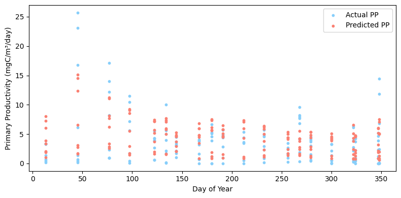

# Data preparation: Load data with DuckDB


```python
import duckdb

# create/connect to database file
con = duckdb.connect("../data/bats.db")

# read csv tables in
con.execute("""
CREATE OR REPLACE TABLE bot AS 
SELECT * FROM read_csv_auto('../data/bats_bottle.csv');
""")
con.execute("""
CREATE OR REPLACE TABLE pp AS 
SELECT * FROM read_csv_auto('../data/bats_primary_productivity.csv');
""")
con.execute("""
CREATE OR REPLACE TABLE pig AS 
SELECT * FROM read_csv_auto('../data/bats_pigments.csv');
""")
con.execute("""
CREATE OR REPLACE TABLE ctd AS 
SELECT * FROM read_csv_auto('../data/bats_ctd.csv');
""")

print("Tables successfully created!")
# print all tables
print(con.execute("SHOW TABLES").fetchall())
# check first few rows of each table
print('PP')
print(con.execute("SELECT * FROM pp LIMIT 5").fetchdf())
print('\nDiscrete Bottle')
print(con.execute("SELECT * FROM bot LIMIT 5").fetchdf())
print('\nCTD')
print(con.execute("SELECT * FROM ctd LIMIT 5").fetchdf())
print('\nPigments')
print(con.execute("SELECT * FROM pig LIMIT 5").fetchdf())

```

    Tables successfully created!
    [('bot',), ('bottle',), ('ctd',), ('pig',), ('pigments',), ('pp',), ('primary_productivity',)]
    PP
               ID       Date             Vessel ISO_DateTime_UTC_CTD_in  \
    0  1000308101 1988-12-18  R/V Cape Henlopen                    None   
    1  1000308102 1988-12-18  R/V Cape Henlopen                    None   
    2  1000308103 1988-12-18  R/V Cape Henlopen                    None   
    3  1000308104 1988-12-18  R/V Cape Henlopen                    None   
    4  1000308105 1988-12-18  R/V Cape Henlopen                    None   
    
      ISO_DateTime_UTC_CTD_out  Latitude_CTD_in  Longitude_CTD_in  \
    0                     None           31.669           -64.049   
    1                     None           31.669           -64.049   
    2                     None           31.669           -64.049   
    3                     None           31.669           -64.049   
    4                     None           31.669           -64.049   
    
       Latitude_CTD_out  Longitude_CTD_out ISO_DateTime_UTC_Array_in  ...  \
    0               NaN                NaN                      None  ...   
    1               NaN                NaN                      None  ...   
    2               NaN                NaN                      None  ...   
    3               NaN                NaN                      None  ...   
    4               NaN                NaN                      None  ...   
    
      decy_CTD_in  decy_CTD_out  yyyymmdd_CTD_in  yyyymmdd_CTD_out  \
    0    1988.965           NaN         19881218          19881218   
    1    1988.965           NaN         19881218          19881218   
    2    1988.965           NaN         19881218          19881218   
    3    1988.965           NaN         19881218          19881218   
    4    1988.965           NaN         19881218          19881218   
    
       yymmdd_Array_in yymmdd_Array_out  hhmm_CTD_in hhmm_CTD_out  hhmm_Array_in  \
    0             <NA>             <NA>         <NA>         <NA>           <NA>   
    1             <NA>             <NA>         <NA>         <NA>           <NA>   
    2             <NA>             <NA>         <NA>         <NA>           <NA>   
    3             <NA>             <NA>         <NA>         <NA>           <NA>   
    4             <NA>             <NA>         <NA>         <NA>           <NA>   
    
       hhmm_Array_out  
    0            <NA>  
    1            <NA>  
    2            <NA>  
    3            <NA>  
    4            <NA>  
    
    [5 rows x 51 columns]
    
    Discrete Bottle
        ISO_DateTime_UTC   Bottle_ID  Latitude  Longitude             Vessel  \
    0  1988-10-20T22:30Z  1000100112    31.783    -64.116  R/V Weatherbird I   
    1  1988-10-20T22:30Z  1000100111    31.783    -64.116  R/V Weatherbird I   
    2  1988-10-20T22:30Z  1000100110    31.783    -64.116  R/V Weatherbird I   
    3  1988-10-20T22:30Z  1000100109    31.783    -64.116  R/V Weatherbird I   
    4  1988-10-20T22:30Z  1000100108    31.783    -64.116  R/V Weatherbird I   
    
       Cruise_num Cruise_type  Cast_num  Bottle_num  QF_bottle  ...  QF_Prochloro  \
    0       10001   BATS Core         1          12          2  ...             9   
    1       10001   BATS Core         1          11          2  ...             9   
    2       10001   BATS Core         1          10          2  ...             9   
    3       10001   BATS Core         1           9          2  ...             9   
    4       10001   BATS Core         1           8          2  ...             9   
    
       Synechococcus  QF_Synecho  Picoeukaryotes  QF_Picoeuk  Nanoeukaryotes  \
    0           <NA>           9            <NA>           9            <NA>   
    1           <NA>           9            <NA>           9            <NA>   
    2           <NA>           9            <NA>           9            <NA>   
    3           <NA>           9            <NA>           9            <NA>   
    4           <NA>           9            <NA>           9            <NA>   
    
       QF_Nanoeuk  yyyymmdd  time  decimal_year  
    0           9  19881020  2230    1988.80311  
    1           9  19881020  2230    1988.80311  
    2           9  19881020  2230    1988.80311  
    3           9  19881020  2230    1988.80311  
    4           9  19881020  2230    1988.80311  
    
    [5 rows x 65 columns]
    
    CTD
             ID ISO_DateTime_UTC_deployed ISO_DateTime_UTC_recovered  \
    0  10001001         1988-10-20T22:30Z          1988-10-21T02:00Z   
    1  10001001         1988-10-20T22:30Z          1988-10-21T02:00Z   
    2  10001001         1988-10-20T22:30Z          1988-10-21T02:00Z   
    3  10001001         1988-10-20T22:30Z          1988-10-21T02:00Z   
    4  10001001         1988-10-20T22:30Z          1988-10-21T02:00Z   
    
                   Vessel  Latitude_deployed  Longitude_deployed  \
    0  R/V Weatherbird II             31.783             -64.116   
    1  R/V Weatherbird II             31.783             -64.116   
    2  R/V Weatherbird II             31.783             -64.116   
    3  R/V Weatherbird II             31.783             -64.116   
    4  R/V Weatherbird II             31.783             -64.116   
    
       Latitude_recovered  Longitude_recovered Cruise_type  Cruise_num  ...  \
    0                 NaN                  NaN   BATS Core       10001  ...   
    1                 NaN                  NaN   BATS Core       10001  ...   
    2                 NaN                  NaN   BATS Core       10001  ...   
    3                 NaN                  NaN   BATS Core       10001  ...   
    4                 NaN                  NaN   BATS Core       10001  ...   
    
       Oxygen  QF_Oxygen    BAC  QF_BAC   Flu  QF_Flu  PAR  QF_PAR  \
    0  205.99          2  0.438       2  None       9  NaN       9   
    1  207.11          2  0.438       2  None       9  NaN       9   
    2  207.69          2  0.438       2  None       9  NaN       9   
    3  207.74          2  0.438       2  None       9  NaN       9   
    4  208.31          2  0.438       2  None       9  NaN       9   
    
       Decimal_Year_deployed  Decimal_Year_recovered  
    0            1988.803108             1988.803506  
    1            1988.803108             1988.803506  
    2            1988.803108             1988.803506  
    3            1988.803108             1988.803506  
    4            1988.803108             1988.803506  
    
    [5 rows x 29 columns]
    
    Pigments
               ID   ISO_DateTime_UTC             Vessel  Latitude  Longitude  \
    0  1000108112  1988-10-21T04:55Z  R/V Weatherbird I    31.833    -64.167   
    1  1000108111  1988-10-21T04:55Z  R/V Weatherbird I    31.833    -64.167   
    2  1000108110  1988-10-21T04:55Z  R/V Weatherbird I    31.833    -64.167   
    3  1000108109  1988-10-21T04:55Z  R/V Weatherbird I    31.833    -64.167   
    4  1000108108  1988-10-21T04:55Z  R/V Weatherbird I    31.833    -64.167   
    
      Cruise_type  Cruise_num  Cast  Cast_type  Bottle_number  ...  QF_p18   p19  \
    0   BATS Core       10001    81  Hydrocast             12  ...       9  <NA>   
    1   BATS Core       10001    81  Hydrocast             11  ...       9  <NA>   
    2   BATS Core       10001    81  Hydrocast             10  ...       9  <NA>   
    3   BATS Core       10001    81  Hydrocast              9  ...       9  <NA>   
    4   BATS Core       10001    81  Hydrocast              8  ...       9  <NA>   
    
       QF_p19   p20  QF_p20   p21  QF_p21  yyyymmdd       decy  time  
    0       9  <NA>       9  <NA>       9  19881021  1988.8033   455  
    1       9  <NA>       9  <NA>       9  19881021  1988.8033   455  
    2       9  <NA>       9  <NA>       9  19881021  1988.8033   455  
    3       9  <NA>       9  <NA>       9  19881021  1988.8033   455  
    4       9  <NA>       9  <NA>       9  19881021  1988.8033   455  
    
    [5 rows x 58 columns]


```python
# clean tables
con.execute("""
-- Clean primary productivity
CREATE OR REPLACE TABLE pp_clean AS
SELECT
    ID,
    Cruise_num,
    CAST(Date AS DATE) AS date,
    Depth,
    Pressure,
    pp
FROM primary_productivity;
""")

con.execute("""
-- Clean bottle
CREATE OR REPLACE TABLE bot_clean AS
SELECT
    Cruise_num,
    Depth,
    Temperature,
    Salinity,
    PO4,
    PON,
    TOC,
    TN,
    POP,
    TDP
FROM bottle;
""")

con.execute("""
-- Clean pigments
CREATE OR REPLACE TABLE pig_clean AS
SELECT
    Cruise_num,
    Depth,
    p1, p2, p3, p14, p16_Chl
FROM pigments;
""")

con.execute("""
-- Clean CTD
CREATE OR REPLACE TABLE ctd_clean AS
SELECT
    Cruise_num,
    Depth,
    Oxygen,
    BAC,
    Flu,
    PAR
FROM ctd;
""")
print('tables cleaned')
```


    <_duckdb.DuckDBPyConnection at 0x78f2d44776b0>


```python
# merge
con.execute("""
CREATE OR REPLACE TABLE merged AS
SELECT
    pp.ID,
    pp.date,
    pp.Depth,
    pp.Pressure,
    pp.pp,

    -- bottle
    bot.Temperature,
    bot.Salinity,
    bot.PO4,
    bot.PON,
    bot.TOC,
    bot.TN,
    bot.POP,
    bot.TDP,

    -- pigments
    pig.p1,
    pig.p2,
    pig.p3,
    pig.p14,
    pig.p16_Chl,

    -- ctd
    ctd.Oxygen,
    ctd.BAC,
    ctd.Flu,
    ctd.PAR

FROM pp_clean pp

LEFT JOIN bot_clean bot
    ON pp.Cruise_num = bot.Cruise_num
    AND ROUND(pp.Depth, 1) = ROUND(bot.Depth, 1)

LEFT JOIN pig_clean pig
    ON pp.Cruise_num = pig.Cruise_num
    AND ROUND(pp.Depth, 1) = ROUND(pig.Depth, 1)

LEFT JOIN ctd_clean ctd
    ON pp.Cruise_num = ctd.Cruise_num
    AND ROUND(pp.Depth, 1) = ROUND(ctd.Depth, 1);
""")
print('table merged')
```


    <_duckdb.DuckDBPyConnection at 0x78f2d44776b0>


# Queries to prepare solution


```python
# data retained after merging
df = con.execute("""
SELECT COUNT(*) AS total_rows,
       COUNT(pp) AS non_null_pp,
       COUNT(Temperature) AS bottle_data,
       COUNT(p1) AS pigment_data,
       COUNT(Oxygen) AS ctd_data
FROM merged;
""").fetchdf()
print(df)

# average primary productivity by depth
df = con.execute("""
SELECT 
    ROUND(Depth, 0) AS depth_bin,
    AVG(pp) AS avg_pp,
    COUNT(*) AS n
FROM merged
GROUP BY depth_bin
ORDER BY depth_bin;
""").fetchdf()
print(df)

# relationship between temperature and primary productivity
df = con.execute("""
SELECT 
    Temperature,
    pp
FROM merged
WHERE Temperature IS NOT NULL AND pp IS NOT NULL
LIMIT 1000;
""").fetchdf()
print(df.head())
```

       total_rows  non_null_pp  bottle_data  pigment_data  ctd_data
    0        7439         7371         5247           466      2903
        depth_bin     avg_pp    n
    0         0.0   6.055000    2
    1         1.0   6.711111  245
    2         2.0  10.978333    6
    3         3.0   6.296744  143
    4         4.0   6.380996  284
    ..        ...        ...  ...
    76      143.0  -0.172000   30
    77      144.0   0.250000    2
    78      145.0  -0.050000    1
    79      146.0   0.630000    1
    80      161.0   0.136667    3
    
    [81 rows x 3 columns]
       Temperature    pp
    0       19.411  0.07
    1       19.411  0.07
    2       19.411  0.07
    3       18.944  0.01
    4       18.944  0.01


# Analysis


```python
# importing packages
import pandas as pd
import numpy as np
import math
import datetime
import matplotlib.pyplot as plt
import xgboost as xgb
from xgboost import XGBRegressor
from sklearn.metrics import mean_squared_error, r2_score, mean_absolute_error
from scipy.stats import norm
from sklearn.model_selection import train_test_split, GridSearchCV

# read in data
orig_df = pd.read_csv('./bats_merged.csv')
#reformatting columns
orig_df = orig_df.apply(pd.to_numeric, errors='coerce').astype('float64')
# converting yymmdd to date time
orig_df['yymmdd'] = pd.to_datetime(orig_df['yymmdd_in'], format='%Y%m%d') #convert to date time
# adding a day of year column
orig_df['day_of_year'] = orig_df['yymmdd'].dt.dayofyear # day out of 365
# renaming variables
orig_df['PP'] = orig_df['pp']
orig_df['TON'] = orig_df['TN']
orig_df['TOP'] = orig_df['TDP']
orig_df['BAC'] = orig_df['Bact']

# choosing features
df = orig_df[["yymmdd", "day_of_year", "Depth", "Chl", "Temp", "Sal", "O2", "NO3", "PO4", "POC", "PON", "POP", "TOC", "TON", "TOP", "BAC", "PP"]].copy()
#Adding additional columns to help with pp seasonality 
# extracting year, month, day
df['year'] = df['yymmdd'].dt.year           
df['month'] = df['yymmdd'].dt.month         
df['day'] = df['yymmdd'].dt.day           
# feature engineering
df["sin_doy"] = np.sin(2 * np.pi * df["day_of_year"] / 365)
df["cos_doy"] = np.cos(2 * np.pi * df["day_of_year"] / 365)
#convert all negative pp values to 0
df.loc[df['PP'] < 0, 'PP'] = 0
#drop nans
df = df.dropna()

# XGBoost model
X = df.drop(columns = ['PP', "yymmdd"])  # predictors, drop target and datetime variable
Y = df['PP'] # target
#forecasting split
test_size = int(0.15 * len(df))
X_train, X_test = X[:-test_size], X[-test_size:]
Y_train, Y_test = Y[:-test_size], Y[-test_size:]
# create model
xgb_mod = xgb.XGBRegressor(n_estimators = 200, learning_rate = 0.01, max_depth = 7, min_child_weight = 5, subsample = 0.6, colsample_bytree = 0.8, gamma = 0, random_state = 42, eval_metric="rmse")
xgb_mod.fit( X_train, Y_train, verbose=False)
# predict
Y_pred = xgb_mod.predict(X_test)

# evaluate w a couple metrics
rmse = math.sqrt(mean_squared_error(Y_test, Y_pred))
r2 = r2_score(Y_test, Y_pred)
mae = mean_absolute_error(Y_test, Y_pred)
print(f"XGB R²: {r2:.3f}")
print(f"RMSE: {rmse:.3f}")
print(f"MAE: {mae:.3f}")

#Plot predictions 
fig, axs = plt.subplots(figsize=(8, 4))
# Scatter plot for actual PP values
axs.scatter(df.loc[Y_test.index, 'day_of_year'], Y_test, color='lightskyblue', label='Actual PP', s=10)
axs.scatter(df.loc[Y_test.index, 'day_of_year'], Y_pred, color='salmon', label='Predicted PP', s=10)
axs.set_xlabel('Day of Year')
axs.set_ylabel('Primary Productivity (mgC/m³/day)')
axs.legend(loc = 'upper right')
plt.tight_layout()
plt.show()
```

    XGB R²: 0.642
    RMSE: 2.422
    MAE: 1.794


    

    


Analysis rationale: 
The goal of this analysis was to predict primary productviity using environmental predictors like temperature, salinity, nutrients, etc. I split the dataset into a 85/15% split, with the first 85% going to the training set and the last 15% going to the test set. This way, I could replicate forecasting conditions. I chose an XGBoost regresison model since it can handle complex data and patterns and is generally suitable for tabular data. I evaluated model performance with 3 main metrics - r^2, rmse, and mae. This allowed me to get a more well rounded evaluation of variability and accuracy in the model predictions. We saw a r^2 score of 0.64, rmse of 2.42, and mae of 1.79, which suggests we can predict primary productivity values relatively well. 

Visualization rationale:

This figure visualizes the actual primary productivity values vs the predicted primary productivity values. These are data points from the test set, and I chose to set the x axis as day of year (instead of over time) to see if there were any patterns in seasonality. The y axis shows primary productivity in its original units, which allows us to see how much error there is in the predictions. With an R^2 of 0.64, we can see that the model does a pretty good job but there is room for improvement. Through the visualization, we can see that the model is generally underpredicting the higher values and overpredicting the lower values. 
